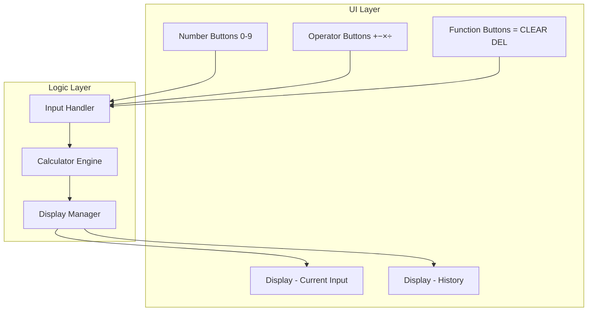
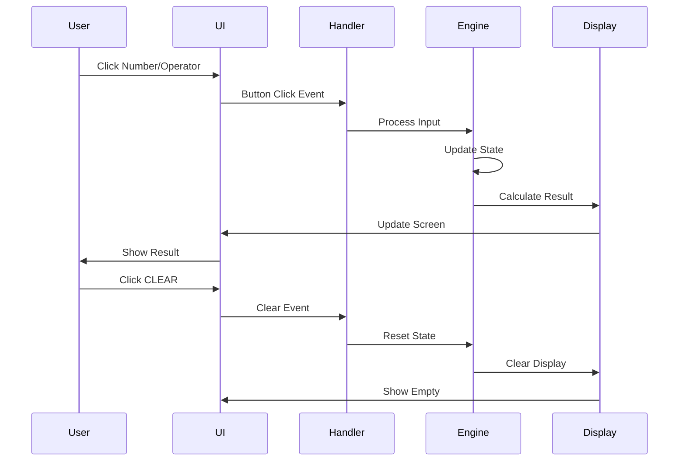
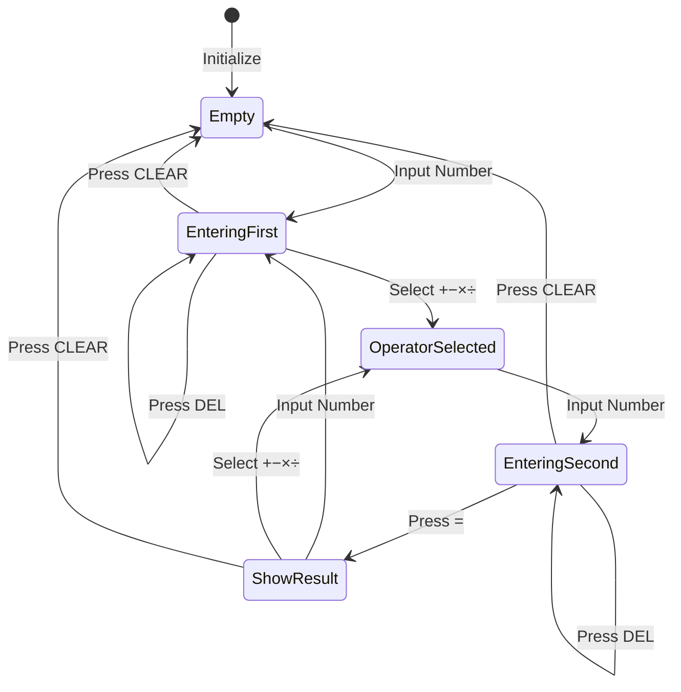

# 🧮 Simple Calculator

A clean, modern calculator web application built with vanilla HTML, CSS, and JavaScript. Features a beautiful gradient design with smooth animations and full mathematical functionality.

## ✨ Features

### Core Functionality
- **Basic Operations**: Addition (+), Subtraction (−), Multiplication (×), Division (÷)
- **Advanced Functions**: 
  - Decimal point support
  - Delete last character (DEL)
  - Clear all (CLEAR)
  - Operation history display
- **Modern UI**:
  - Beautiful purple gradient background (#667eea to #764ba2)
  - Smooth hover animations
  - Responsive button design
  - Clean, intuitive interface
- **Real-time Display**: Shows current input and operation history

## 🚀 Quick Start

1. Open `index.html` in your web browser
2. Click buttons or use keyboard to perform calculations

## 📁 Project Structure

```
01Calculator/
├── index.html          # Main HTML structure with embedded CSS
├── script.js           # Calculator logic and functionality
└── README.md           # This documentation
```

## 🏗️ Application Architecture



## 📊 Data Flow Diagram



## 🔄 Calculator State Machine



## 🎨 Design Features

### Color Scheme
- **Background Gradient**: Purple (#667eea to #764ba2)
- **Number Buttons**: Light gray (#eee) → hover (#ddd)
- **Operator Buttons**: Purple gradient with glow effect
- **Equals Button**: Dark purple (#764ba2), spans 2 columns
- **Clear Button**: Red (#e74c3c), spans 2 columns
- **Delete Button**: Orange (#f39c12)

### Button Layout (4×5 Grid)
```
╔══════════════════════════╗
║   History Display        ║
║   Current Input          ║
╠══════╦══════╦══════╦═════╣
║  7   ║  8   ║  9   ║  ÷  ║
╠══════╬══════╬══════╬═════╣
║  4   ║  5   ║  6   ║  ×  ║
╠══════╬══════╬══════╬═════╣
║  1   ║  2   ║  3   ║  −  ║
╠══════╬══════╬══════╬═════╣
║  .   ║  0   ║ DEL  ║  +  ║
╠══════╧══════╬══════╧═════╣
║   CLEAR     ║      =      ║
╚═════════════╩═════════════╝
```

### Animation Effects
- **Button Hover**: Transform scale(1.05) + brightness
- **Button Click**: Active state with shadow
- **History Update**: Smooth fade-in animation
- **Result Display**: Number highlighting

## 💻 How to Use

### Basic Operation Flow
1. Click number buttons to input digits (0-9)
2. Click operator buttons (+, −, ×, ÷) to select operation
3. Click more numbers for the second operand
4. Click **=** to calculate the result
5. Continue with more operations or **CLEAR** to reset

### Special Functions
- **Decimal Point (.)**: Add decimal numbers (e.g., 3.14)
- **DEL**: Remove last character from input
- **CLEAR**: Reset calculator to initial state
- **Chaining**: Result becomes first number for next operation

## 🔧 Technologies Used

- **HTML5**: Semantic structure and layout
- **CSS3**: 
  - CSS Grid for button layout
  - Flexbox for display area
  - Custom gradients and animations
  - Responsive design with media queries
- **JavaScript**: 
  - Event listeners for button clicks
  - Mathematical operations
  - Display management
  - History tracking

## 📱 Responsive Design

The calculator automatically adjusts for screens **≤ 400px**:
- Reduced container width (90% → 95%)
- Smaller padding (30px → 20px)
- Adjusted font sizes for mobile viewing

```css
@media (max-width: 400px) {
    .calculator {
        width: 95%;
        padding: 20px;
    }
}
```

## 🎯 Key Features Breakdown

| Feature | Implementation | Benefit |
|---------|----------------|---------|
| **Real-time History** | Previous operation shown above | Context awareness |
| **Chained Calculations** | Result used as next input | Efficient workflow |
| **Decimal Support** | . button with validation | Precise calculations |
| **Error Prevention** | Multiple decimal check | Data integrity |
| **Visual Feedback** | Hover and active states | User confidence |
| **Responsive Layout** | CSS Grid + Media queries | Cross-device support |

## 🔍 Code Highlights

### Display Update Function
```javascript
function updateDisplay() {
    currentDisplay.textContent = currentInput || '0';
    historyDisplay.textContent = history;
}
```

### Operation Handler
```javascript
function handleOperation(operator) {
    if (currentInput !== '') {
        if (previousInput !== '') {
            calculate();
        }
        previousOperator = operator;
        previousInput = currentInput;
        currentInput = '';
        updateHistory();
    }
}
```

## 🎨 Design Philosophy

- **Minimalist**: Clean interface without clutter
- **Intuitive**: Familiar calculator layout
- **Responsive**: Works on any screen size
- **Accessible**: Clear visual hierarchy and feedback
- **Modern**: Gradient design and smooth animations

## 💡 Learning Outcomes

This project demonstrates:
- ✅ DOM manipulation and event handling
- ✅ CSS Grid and Flexbox layout
- ✅ State management in vanilla JavaScript
- ✅ Responsive web design techniques
- ✅ User experience considerations
- ✅ Clean code organization

## 🚀 Future Enhancements

Possible improvements:
- [ ] Keyboard input support
- [ ] Scientific calculator mode
- [ ] Calculation history log
- [ ] Memory functions (M+, M-, MR, MC)
- [ ] Theme customization
- [ ] Expression evaluation

## 📄 License

This project is part of the InternPE internship program.

---

**Made with 💜 during InternPE Internship**

*Simple, elegant, functional* ✨
