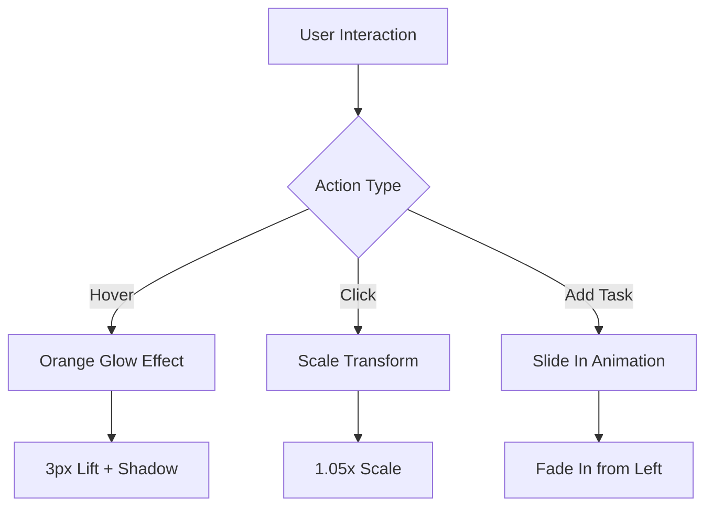
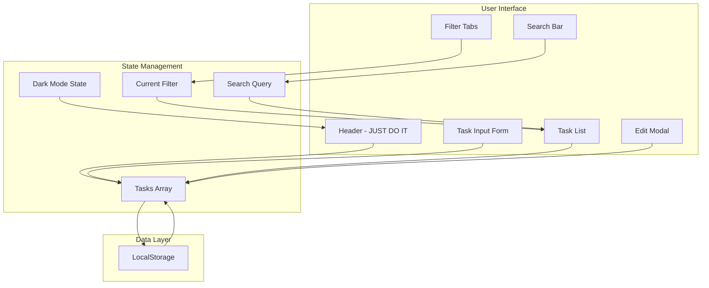
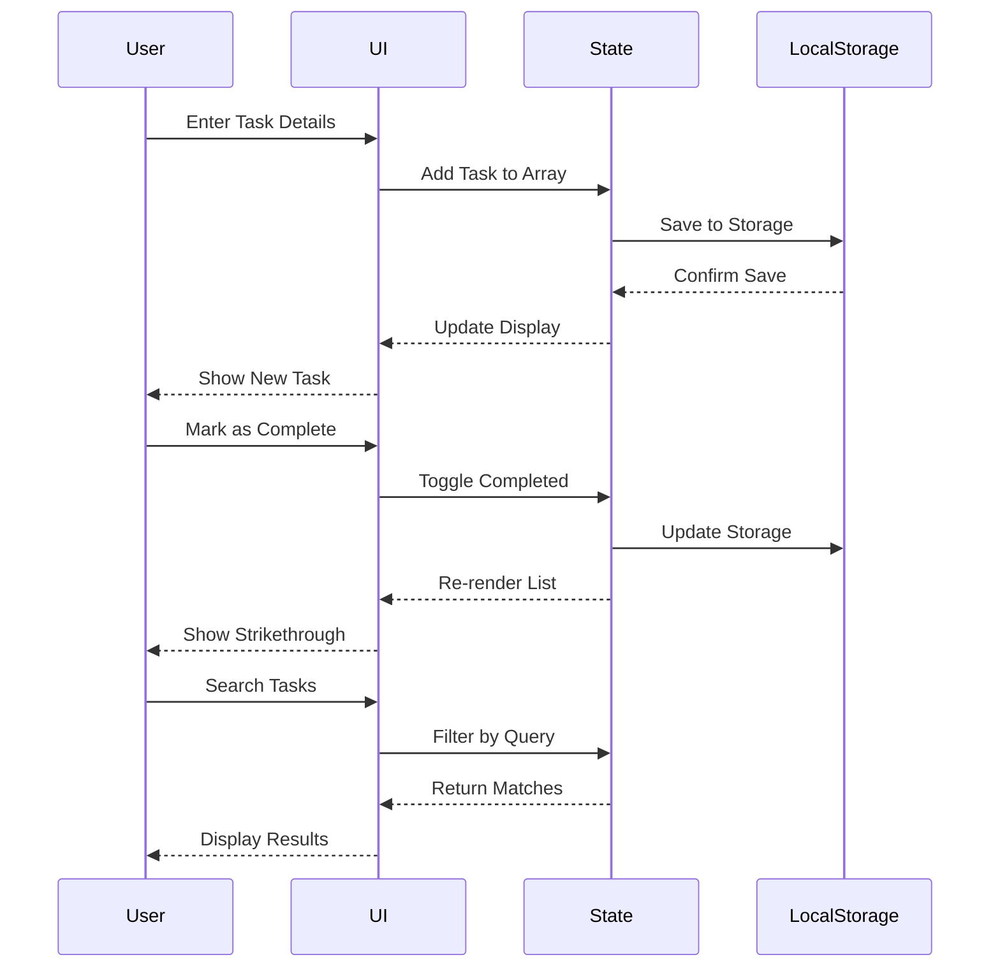
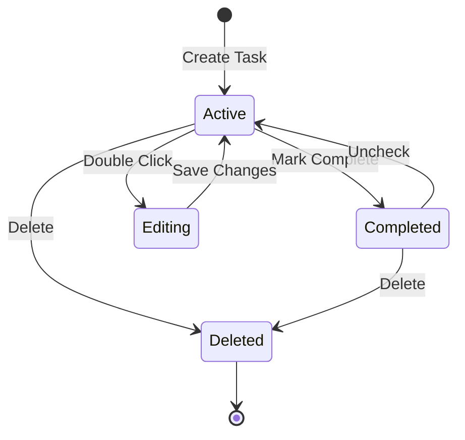

# ✅ JUST DO IT - Nike-Inspired Todo App

> **Don't Think • Just Do • Make It Happen**

A bold, energetic task management application inspired by Nike's "Just Do It" philosophy. Features a vibrant orange and black color scheme with dynamic animations and professional task management capabilities.

## 🎨 Nike Theme Design

This todo app embodies the Nike spirit with:
- **Bold Orange (#FF6B00)**: Primary color inspired by Nike's energetic branding
- **Deep Black**: High-contrast backgrounds for athletic aesthetic
- **Dynamic Animations**: Energetic hover effects and glowing interactions
- **Action-Oriented**: "JUST DO IT" messaging encouraging productivity

## ✨ Features

### Core Functionality
- ✅ **Add, Edit & Delete Tasks** - Full CRUD operations
- 🎯 **Smart Filtering** - Filter by All, Active, or Completed
- 🔍 **Search** - Instantly find tasks by keyword
- 💾 **Auto-Save** - Data persists in localStorage
- � **Nike-Themed UI** - Bold orange and black design

### Advanced Features
- 📅 **Due Dates** - Set deadlines with visual overdue warnings
- 🏷️ **Categories** - Organize with Work, Personal, Shopping, Health, Other
- ⚡ **Priority Levels** - High (Red), Medium (Orange), Low (Green) with color indicators
- 🌓 **Dark Mode** - Toggle between light and dark Nike themes
- 🎯 **Drag & Drop** - Reorder tasks by dragging
- ✏️ **Quick Edit** - Double-click any task to edit

## 🎮 How to Use

### Adding Tasks
1. Type your task in the main input
2. (Optional) Set a due date
3. (Optional) Choose a category
4. (Optional) Set priority level
5. Click **ADD** or press **Enter**

### Managing Tasks
- **Complete**: Click the checkbox
- **Edit**: Double-click the task text or click edit icon
- **Delete**: Click the X button
- **Reorder**: Drag and drop tasks

### Filtering & Search
- Use **All/Active/Completed** tabs for status filtering
- Click category buttons (Work, Personal, Shopping, Health, Other)
- Use the search box to find specific tasks

### Dark Mode
- Click the sun/moon icon in the header to toggle Nike dark mode

## 📁 File Structure

```
03JustDoIT/
├── index.html      # Main HTML with Nike branding
├── styles.css      # Nike-themed styling and animations
├── script.js       # Application logic
└── README.md       # This file
```

## 🎨 Nike Design System

### Color Palette

| Color | Hex | Usage |
|-------|-----|-------|
| Nike Orange | #FF6B00 | Primary actions, buttons, active states |
| Dark Orange | #E55D00 | Hover states, gradients |
| Black | #111111 | Text, dark mode backgrounds |
| White | #FFFFFF | Light mode backgrounds, text on dark |
| Success Green | #00C853 | Completed tasks, low priority |
| Alert Red | #FF1744 | High priority, overdue tasks |

### Typography
- **Header**: Extra-bold (900), uppercase, wide letter spacing
- **Body**: System font stack for optimal performance
- **Buttons**: Bold (700), uppercase with spacing

### Animations


## 🏗️ Application Architecture



## � Data Flow Diagram



## 🔄 Task State Management



## 🎯 Features Overview

| Feature | Description | Nike Enhancement |
|---------|-------------|------------------|
| **Task Management** | Create, read, update, delete tasks | Orange glowing buttons |
| **Due Dates** | Date picker with overdue indicators | Red alerts for overdue |
| **Categories** | 5 predefined categories with colors | Nike orange active states |
| **Priorities** | High (red), Medium (orange), Low (green) | Bold left border indicators |
| **Dark Mode** | Full dark theme with preference saving | Deep black Nike aesthetic |
| **Drag & Drop** | Reorder tasks with smooth animations | Orange hover highlights |
| **Search** | Real-time task filtering | Instant orange focus ring |
| **Filters** | Status and category filtering | Bold orange active tabs |
| **Persistence** | All data saved to localStorage | Automatic, seamless |
| **Responsive** | Mobile-friendly design | Energetic at all sizes |

## 💻 Technology Stack

- **HTML5** - Semantic markup with ARIA labels
- **CSS3** - Custom properties, Flexbox, Grid, Nike animations
- **JavaScript (ES6+)** - Modern vanilla JS, no frameworks
- **LocalStorage API** - Client-side data persistence

## 🌟 Nike Design Highlights

### 1. **Animated Background**
- Black-to-gray diagonal gradient
- 10-second smooth animation
- Rotating orange accent element (20s)
- Creates sense of motion and energy

### 2. **Header Design**
- Orange-to-black gradient
- Bold "JUST DO IT" branding
- Pulsing animation (3s cycle)
- Motivational subtitle

### 3. **Button Interactions**
- **Hover**: 5% scale + 3px lift + orange glow
- **Active**: Bold orange background
- **Shadow**: Dynamic orange/red shadows
- **Transition**: Smooth 200ms ease

### 4. **Task Cards**
- Orange border glow on hover
- 3px lift effect
- Priority color indicators (left border)
- Smooth fade when completed

## 🎨 CSS Animation Examples

### Orange Glow Effect
\`\`\`css
.add-btn:hover {
    transform: translateY(-3px) scale(1.05);
    box-shadow: 0 8px 24px rgba(255, 107, 0, 0.4),
                0 0 20px rgba(255, 107, 0, 0.3);
}
\`\`\`

### Task Item Hover
\`\`\`css
.task-item:hover {
    border-color: #FF6B00;
    box-shadow: 0 6px 20px rgba(255, 107, 0, 0.25),
                0 0 12px rgba(255, 107, 0, 0.15);
    transform: translateY(-3px);
}
\`\`\`

## 📱 Responsive Design

The Nike theme maintains full responsiveness:

- **Desktop (1920px)**: Full layout with all features visible
- **Tablet (768px)**: Stacked input layout
- **Mobile (375px)**: Single-column layout with adjusted spacing

All hover effects and animations scale appropriately for touch interfaces.

## 🎯 Keyboard Shortcuts

- **Enter** - Add new task (when input focused)
- **Escape** - Close edit modal
- **Double-click** - Edit task

## 🚀 Performance

- **Zero Dependencies** - No external libraries or fonts
- **Optimized Animations** - GPU-accelerated transforms
- **Efficient Rendering** - Minimal DOM manipulation
- **Fast Load** - < 100KB total size

## 🔧 Browser Support

Works on all modern browsers:
- ✅ Chrome/Edge (latest)
- ✅ Firefox (latest)
- ✅ Safari (latest)

## 📝 Code Quality

- Clean, commented, maintainable code
- Semantic HTML structure
- ARIA labels for accessibility
- Consistent naming conventions
- Modular JavaScript functions

## 🎨 Design Philosophy

> **Nike "Just Do It" Philosophy**
> 
> This app embodies Nike's core values:
> - **Bold**: High-contrast orange (#FF6B00) and black
> - **Energetic**: Dynamic animations and hover effects
> - **Action-oriented**: "JUST DO IT" messaging
> - **Confident**: Strong typography and decisive interactions
> - **Clean**: Minimalist design focusing on action

## 🌟 What Makes This Different

Unlike typical todo apps, JUST DO IT:
- Motivates with Nike branding and energy
- Uses bold, athletic color scheme
- Features dynamic, confidence-boosting animations
- Encourages action with every interaction
- Maintains professional task management capabilities

---

**Just Do It! ✓**

*Built with 🟠 using Nike-inspired design principles*
